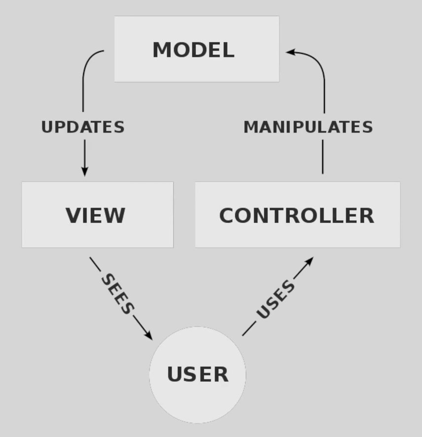

## Steps:-

-   `laravel new example`
-   laravel-dev-demo.test (to check the live website , if you are not using herd run php artisan serve)
-   php artisan migrate:fresh
-   php artisan migrate
-   php artisan make:migration

## Notes

-   blade is laravel templating engine
-   view is a representation of the user interface that is typically rendered as HTML\
-   {{$slot}} // blade helper which directly translates to php echo and whatever the name of variable
-   namespaces are used to organize and group related classes, interfaces, and traits. Example: `App\Models\Job`
-   Data encapsulation is a fundamental concept in object-oriented programming (OOP) that involves bundling the data (attributes) and the methods (functions) that operate on the data into a single unit, typically a class.

## Imp Points

MVC (Model-View-Controller) is a software architectural pattern commonly used for developing user interfaces that divides an application into three interconnected components:

### Model:

-   Represents the data and the business logic of the application.
-   Manages the data, logic, and rules of the application.
-   Directly manages the data, logic, and rules of the application.
-   **Example**: In a Laravel application, Eloquent models represent the Model layer.

### View:

-   Represents the UI of the application.
-   Displays the data from the Model to the user.
-   Sends user commands to the Controller.
-   **Example**: In a Laravel application, Blade templates represent the View layer.

### Controller:

-   Acts as an intermediary between Model and View.
-   Receives input from the user via the View, processes it (often by calling methods on the Model), and returns the output display to the View.
-   **Example**: In a Laravel application, Controllers handle the HTTP requests and return responses.

